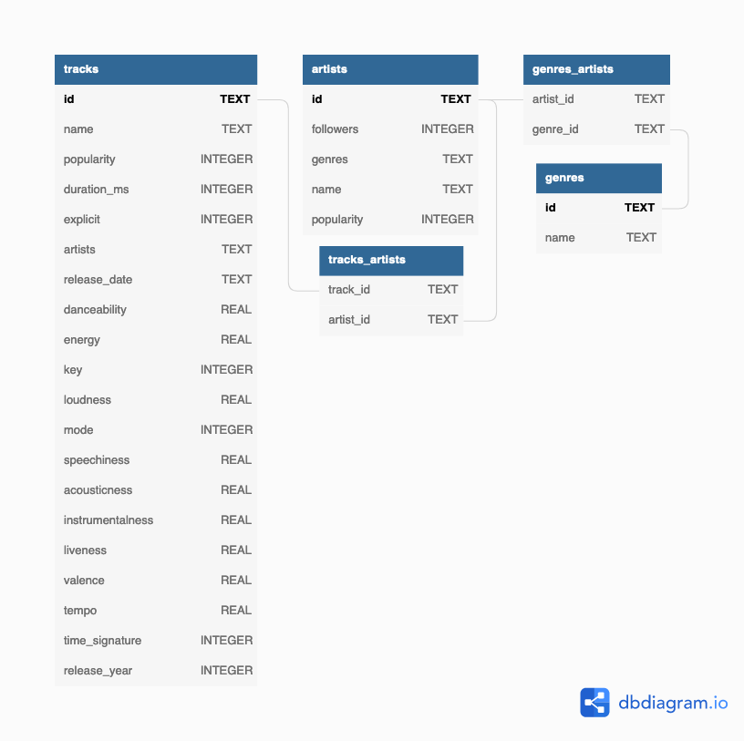

# Designing and Cleaning a Spotify Database in SQLite and Python

## Overview

This project designs and cleans a database of Spotify songs, artists, and genres using SQLite and Python. The data comes from a Kaggle data set containing about 600k tracks and 1 million artists from Spotify from 1921 to 2020. While this is by no means close to all the music on Spotify, it is enough to include a lot of great music from a wide range of time periods.

## Data

The data comes from [this Kaggle data set](https://www.kaggle.com/datasets/yamaerenay/spotify-dataset-19212020-600k-tracks?select=tracks.csv), which is licensed under the [Community Data License Agreement – Sharing, Version 1.0](https://cdla.dev/sharing-1-0/). The data consists of two .csv files, one for tracks and one for artists. The data files are very large and are not uploaded to this repository, but they can be obtained directly from Kaggle.

The data have the following fields, as described in the [Spotify documentation](https://developer.spotify.com/documentation/web-api/reference/#/):

### Artists

* <b>id:</b> The Spotify ID of the artist.
* <b>followers:</b> The total number of followers.
* <b>genres:</b> A list of the genres the artist is associated with. If not yet classified, the array is empty.
* <b>name:</b> The name of the artist.
* <b>popularity:</b> The popularity of the artist. The value will be between 0 and 100, with 100 being the most popular. The artist's popularity is calculated from the popularity of all the artist's tracks.

### Tracks

* <b>id:</b> The Spotify ID for the track.
* <b>name:</b> The name of the track.
* <b>popularity:</b> The popularity of a track is a value between 0 and 100, with 100 being the most popular. The popularity is calculated by algorithm and is based, in the most part, on the total number of plays the track has had and how recent those plays are.
* <b>duration_ms:</b> The track length in milliseconds.
* <b>explicit:</b> Whether or not the track has explicit lyrics (true = yes it does; false = no it does not OR unknown).
* <b>artists:</b> The artists who performed the track.
* <b>id_artists:</b> The Spotify IDs for the artists.
* <b>release_date:</b> The date the album was first released.
* <b>danceability:</b> Danceability describes how suitable a track is for dancing based on a combination of musical elements including tempo, rhythm stability, beat strength, and overall regularity. A value of 0.0 is least danceable and 1.0 is most danceable.
* <b>energy:</b> Energy is a measure from 0.0 to 1.0 and represents a perceptual measure of intensity and activity. Typically, energetic tracks feel fast, loud, and noisy. For example, death metal has high energy, while a Bach prelude scores low on the scale. Perceptual features contributing to this attribute include dynamic range, perceived loudness, timbre, onset rate, and general entropy.
* <b>key:</b> The key the track is in. Integers map to pitches using standard Pitch Class notation. E.g. 0 = C, 1 = C♯/D♭, 2 = D, and so on. If no key was detected, the value is -1. >= -1 <= 11
* <b>loudness:</b> The overall loudness of a track in decibels (dB). Loudness values are averaged across the entire track and are useful for comparing relative loudness of tracks. Loudness is the quality of a sound that is the primary psychological correlate of physical strength (amplitude). Values typically range between -60 and 0 db.
* <b>mode:</b> Mode indicates the modality (major or minor) of a track, the type of scale from which its melodic content is derived. Major is represented by 1 and minor is 0.
* <b>speechiness:</b> Speechiness detects the presence of spoken words in a track. The more exclusively speech-like the recording (e.g. talk show, audio book, poetry), the closer to 1.0 the attribute value. Values above 0.66 describe tracks that are probably made entirely of spoken words. Values between 0.33 and 0.66 describe tracks that may contain both music and speech, either in sections or layered, including such cases as rap music. Values below 0.33 most likely represent music and other non-speech-like tracks.
* <b>acousticness:</b> A confidence measure from 0.0 to 1.0 of whether the track is acoustic. 1.0 represents high confidence the track is acoustic. >= 0 <= 1
* <b>instrumentalness:</b> Predicts whether a track contains no vocals. "Ooh" and "aah" sounds are treated as instrumental in this context. Rap or spoken word tracks are clearly "vocal". The closer the instrumentalness value is to 1.0, the greater likelihood the track contains no vocal content. Values above 0.5 are intended to represent instrumental tracks, but confidence is higher as the value approaches 1.0.
* <b>liveness:</b> Detects the presence of an audience in the recording. Higher liveness values represent an increased probability that the track was performed live. A value above 0.8 provides strong likelihood that the track is live.
* <b>valence:</b> A measure from 0.0 to 1.0 describing the musical positiveness conveyed by a track. Tracks with high valence sound more positive (e.g. happy, cheerful, euphoric), while tracks with low valence sound more negative (e.g. sad, depressed, angry). >= 0 <= 1
* <b>tempo:</b> The overall estimated tempo of a track in beats per minute (BPM). In musical terminology, tempo is the speed or pace of a given piece and derives directly from the average beat duration.
* <b>time_signature:</b> An estimated time signature. The time signature (meter) is a notational convention to specify how many beats are in each bar (or measure). The time signature ranges from 3 to 7 indicating time signatures of "3/4", to "7/4". >= 3 <= 7

In the completed database, the data will be normalized into five tables according to the following schema:

## Project Organization

The project code is organized into several parts:

* The create_spotify_db file covers creating and normalizing the database.
* The clean_spotify_db file covers cleaning the database.
* The funcs.py module contains several functions used in the project.
* The images folder contains images used in the project.
* The requirements.txt file contains the packages required to run the project.
